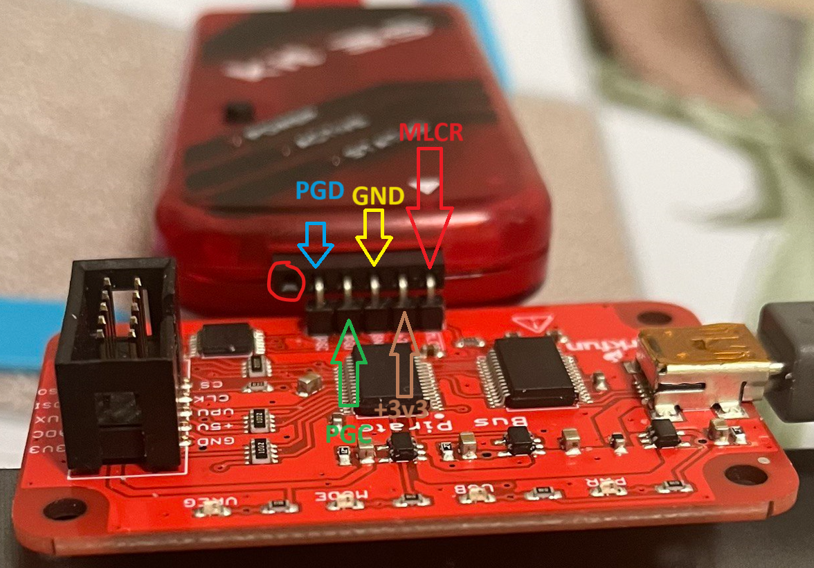
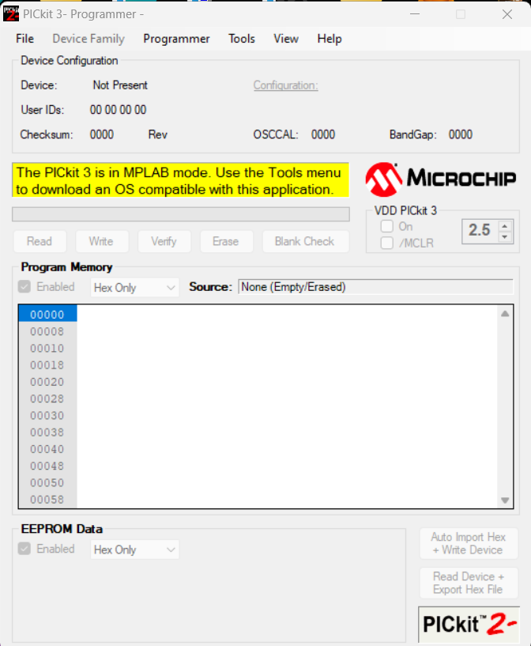
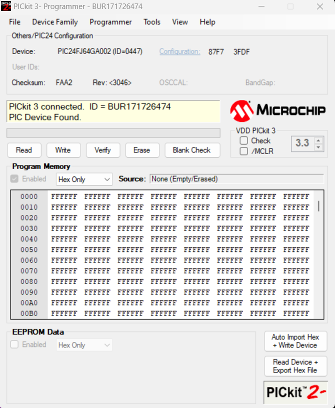
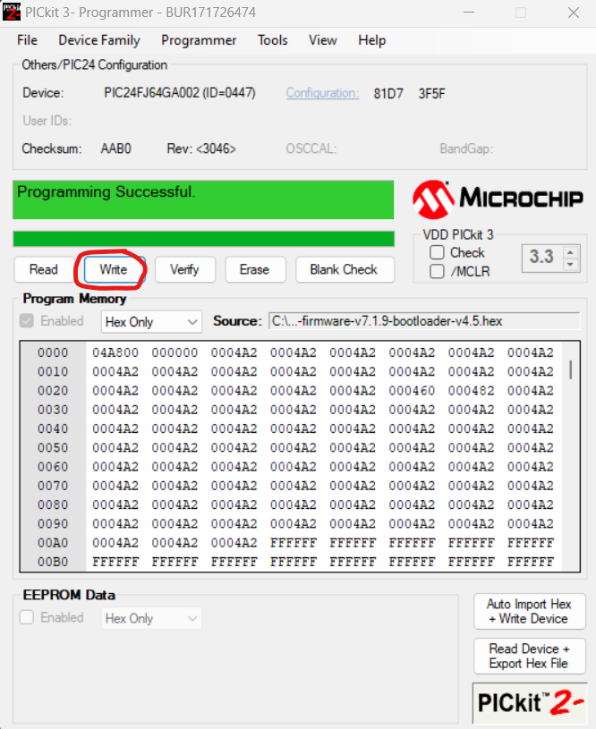

Have you tried updating the bootloader of Buzzpirat or Bus Pirate v3 and it doesn't work? Doesn't it even enter bootloader mode when bridging the PGD and PGC pins? Don't worry, there are several ways to fix it.

## Unbrick using another Bus Pirate v3

The Bus Pirate v3 can be used as an inexpensive PIC programmer.

Total cost: ~40$

- Buy a Bus Pirate v3 + USB mini -> USB A cable
- Buy 5 dupont cables FEMALE-FEMALE

### Downgrade your Bus Pirate v3 firmware

You must install this version because the picprog program only works with certain firmwares.


Download **BPv3-Firmware-v5.9-extras.hex** firmware from this page: 
- https://github.com/therealdreg/buzzpirat/tree/main/bin/oldfirm


Download the last buzzloader app (There are versions available for Windows, Linux and Mac) from this page:
- https://github.com/therealdreg/buzzpirat/tree/main/bin/buzzloader

- put a jumper/dupont_wire connecting the PGD pin to the PGC pin
- connect the Bus Pirate v3 to your computer via a usb cable
- check for the new COM port assignment in the device manager (e.g., COM29)

Make sure to close Tera Term or any other software that might be using the COM port to free it up and execute:
```plaintext
buzzloader.exe --dev=COM29 --hex=BPv3-Firmware-v5.9-extras.hex
```


```plaintext
Erasing page 41, a400...OK
Writing page 41 row 328, a400...OK
Writing page 41 row 329, a480...OK
Writing page 41 row 330, a500...OK
Writing page 41 row 331, a580...OK
Writing page 41 row 332, a600...OK
Writing page 41 row 333, a680...OK
Writing page 41 row 334, a700...OK
Writing page 41 row 335, a780...OK

Firmware updated successfully :)!
Use screen com30 115200 to verify
```

Remove the jumper/Dupont cable, then reconnect the device to the USB port, and you're all set! You should now have the  firmware installed. 

Run the 'i' command and perform a self-test with the '~' command to ensure everything has gone smoothly.

```plaintext
i
Bus Pirate v3b
Firmware v5.9 (r529) [HiZ 2WIRE 3WIRE KEYB LCD DIO] Bootloader v4.5
DEVID:0x0447 REVID:0x3046 (24FJ64GA002 B8)
http://dangerousprototypes.com
HiZ>
```

### Connect to the Bus Pirate v3 to Bricked Buzzpirat / Bricked Bus Pirate v3

Locate the PIC programming pins on the bricked device. Look for the pin named: MCLR.

Connect the pins using Dupont cables in the following manner:

| Bus Pirate v3 | Bricked device |
| --- | --- |
| CLK | PGC |
| MOSI | PGD |
| GND | GND |
| +3v3 | +3v3 |
| CS | MCLR |

### Burn a new bootloader and firmware to the bricked device


Download the firmware labeled with "pickit" in its name

If you are unbricking a Buzzpirat. Download the last bootloader + firmware .hex file from this page:
- https://github.com/therealdreg/buzzpirat/tree/main/bin/stablefirm

If you are unbricking a Bus Pirate v3. Download the last bootloader + firmware .hex file from this page:
- https://github.com/therealdreg/buzzpirat/tree/main/bin/stablefirm/bpv3comp

Download the last picprog app from this page:
- https://github.com/therealdreg/buzzpirat/tree/main/bin/picprog

Ensure that the bricked device and the Bus Pirate v3 are connected to the PC via USB.

Make sure to close Tera Term or any other software that might be using the COM port to free it up and execute: (my Bus Pirate v3 is on COM29):

```plaintext
picprog.exe -p buspirate -u COM29 -s 115200 -c 24FJ64GA002 -t HEX -w BZ-pickit-firmware-v7.1.6969-bootloader-v4.5.hex -E
```

```plaintext
Skipping page 333 [ 0x014d00 ], not used
Skipping page 334 [ 0x014e00 ], not used
Writing page 335, 14f00...
Writing page 336, 15000...
Writing page 337, 15100...
Writing page 338, 15200...
Writing page 339, 15300...
Skipping page 340 [ 0x015400 ], not used
Skipping page 341 [ 0x015500 ], not used
Skipping page 342 [ 0x015600 ], not used
Writing page 343, 15700...
```

Remove the Dupont cables from MCLR, PGD, PGC, GND, +3v3 pins, then reconnect the bricked device to the USB port, and you're all set! You should now have the bootloader+firmware installed.

Run the 'i' command and perform a self-test with the '~' command to ensure everything has gone smoothly.

```plaintext
HiZ>i
Bus Pirate v3.5
Community Firmware v7.1 - buzzpirat.com by Dreg BZ SIXTHOUSANDNINEHUNDREDSIXTYNINE [HiZ 1-WIRE UART I2C SPI 2WIRE 3WIRE KEYB LCD PIC DIO] Bootloader v4.5
DEVID:0x0447 REVID:0x3046 (24FJ64GA00 2 B8)
http://dangerousprototypes.com
HiZ>
```

Now, [reinstall]() the latest firmware on your Bus Pirate v3 (the one you used as a PIC programmer). 


## Unbrick using clones like PICkit3.5

Buy a PICkit3.5 from Aliexpress (an inexpensive PIC programmer).

Total cost: ~30$

Download the last pickit minus app from this page:
- https://github.com/therealdreg/buzzpirat/tree/main/bin/pickitminus

If you are unbricking a Buzzpirat. Download the last bootloader + firmware .hex file from this page:
- https://github.com/therealdreg/buzzpirat/tree/main/bin/stablefirm

If you are unbricking a Bus Pirate v3. Download the last bootloader + firmware .hex file from this page:
- https://github.com/therealdreg/buzzpirat/tree/main/bin/stablefirm/bpv3comp

Connect Buzzpirat / Bus Pirate pins to the pins located furthest to the right of the Pickit:



Open the pickitminus app



Go to Tools -> Download PICkit Operating System


Select .hex for pickit minus use




Go to File -> Import Hex

And select the Buzzpirat / Buspirate "bootloader + firmware" .hex file (with pickit in its name, example: BZ-pickit-firmware-v7.1.9-bootloader-v4.5.hex)


Click on Write



Done!